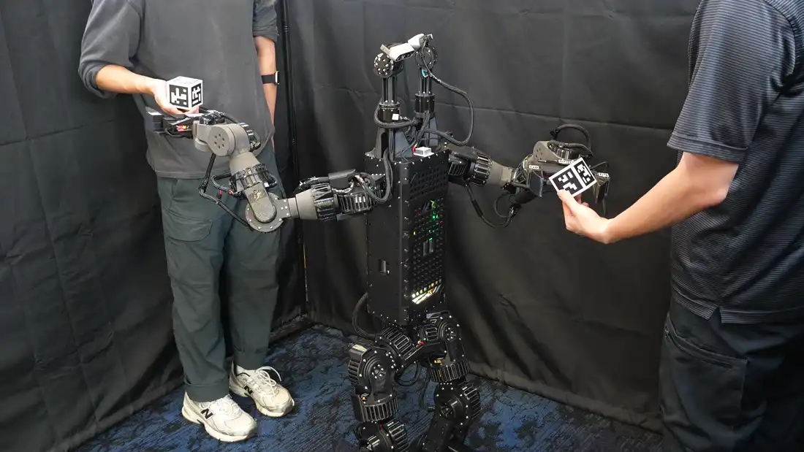
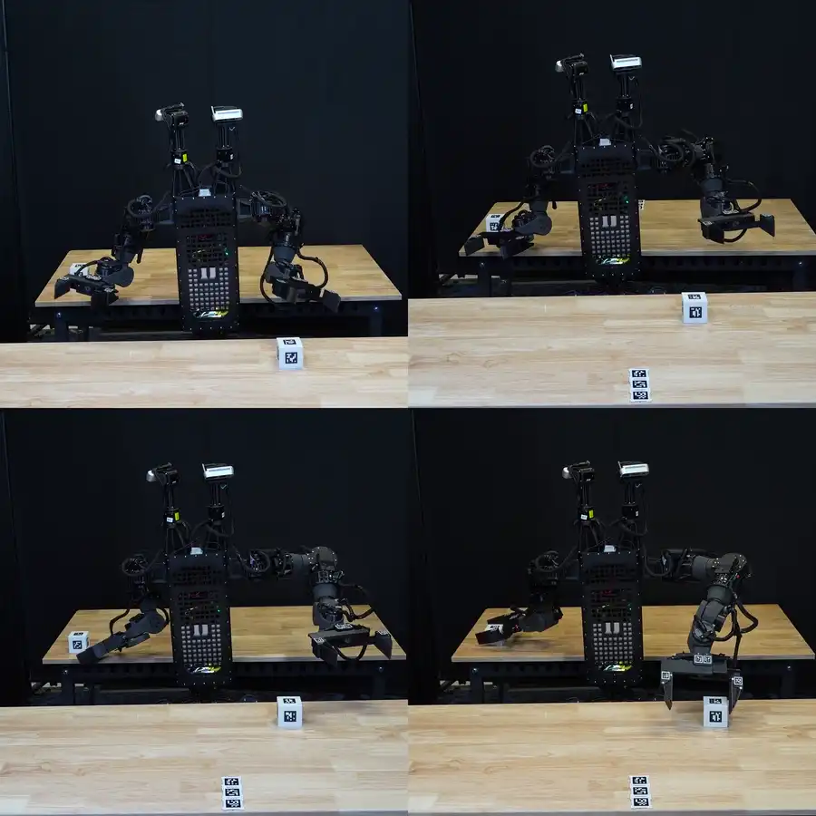
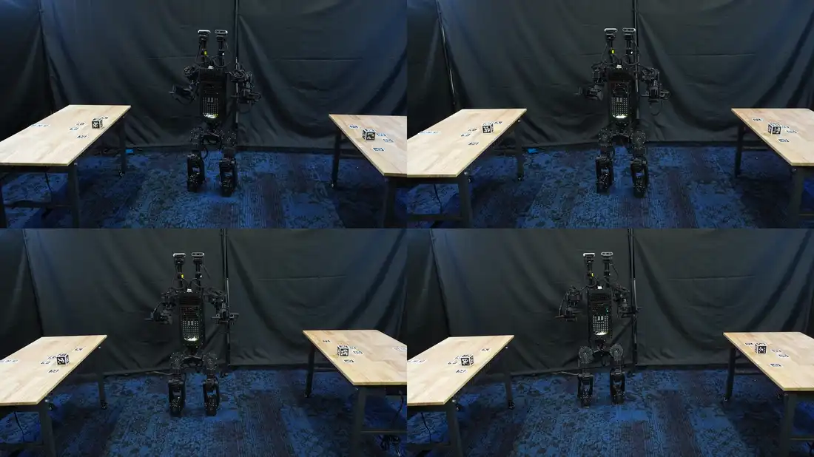

<div align="center">

# Duke Humanoid V2: control stack

**Everything that runs on the robot: the 50 Hz policy loop, the perception
bridge, the cuRobo planning client, the gripper service and the autonomous
operator.**

**Paper** (preprint coming) &middot;
**[Project entry point](https://github.com/generalroboticslab/duke_humanoid_v2)** &middot;
**[Simulation &amp; training](https://github.com/generalroboticslab/duke_humanoid_v2_simulation)** &middot;
**[Operations runbook](control/docs/OPERATIONS.md)**

[](LICENSE)


</div>



<div align="center"><i>This stack, running. Two moving targets carried by two
people on opposite sides; each camera module tracks one target and the arm on
that side follows it, both at once.</i></div>

> **Safety.** This code moves a 36 kg machine with people beside it. Every
> control constant, wire-protocol field, timing budget and safety gate here has
> a hardware run behind it, and most carry the incident that produced them in a
> comment. [`control/docs/auto_operator_incidents.md`](control/docs/auto_operator_incidents.md)
> lists the failures these mechanisms exist to prevent, each with the
> "simplification" that would bring it back. Read
> [`control/docs/OPERATIONS.md`](control/docs/OPERATIONS.md) before running anything.

The onboard control software for the Duke Humanoid V2: a 31-DoF, 36 kg bipedal
humanoid with two 7-DoF arms, parallel grippers and two independently actuated
yaw-pitch RGB-D camera gimbals.

The robot was built so its two cameras could aim at separated work regions
independently, which is what keeps a two-target task from becoming a sequence of
torso rotations. That only pays off if the stack can hold two views while both
arms work, so the cameras are not a look-at controller bolted on the side. Gaze
targets arrive on the same 9874 stream as arm targets, and the policy treats
them the same way it treats the arms: one tick, `default pose + arm baseline +
gaze reference + policy residual`. Gaze does keep its own silence timer, because
a gaze-only keepalive must not be read as the arms still being commanded.

Policy *training* lives in
[`duke_humanoid_v2_simulation`](https://github.com/generalroboticslab/duke_humanoid_v2_simulation);
this one deploys the exported result. Both are submodules of
[**duke_humanoid_v2**](https://github.com/generalroboticslab/duke_humanoid_v2),
the project entry point, which has the hardware specifications and the results.

## Contents

- [What this stack does on hardware](#what-this-stack-does-on-hardware)
- [What is in here](#what-is-in-here)
- [System diagram](#system-diagram)
- [Hardware this targets](#hardware-this-targets)
- [Install](#install)
- [Running it](#running-it)
- [Tests](#tests)
- [Repository layout](#repository-layout)
- [Provenance and licence](#provenance-and-licence)
- [Citation](#citation)

## What this stack does on hardware

Four trials play together in each clip. The autonomous operator
(`control/humanoid_auto_operator.py`) drives all of them; nothing below is
teleoperated.

<table>
<tr>
<td width="50%"></td>
<td width="50%"></td>
</tr>
<tr>
<td><b>Left and right, within reach.</b> Both cameras hold their own target while
both arms work, which is the case the gaze stream exists for.</td>
<td><b>Front and behind.</b> The separation a single forward-facing view cannot
cover.</td>
</tr>
</table>



**Out of reach, so it walks.** SEARCH to GO to REACH to PARK per visit, with the
base driving until the cube is arm-reachable. This is the path through
`humanoid_curobo_reach.py` that the retreat verdicts and MPC session management
exist to make survivable.

## What is in here

| Area | Entry point | Notes |
|---|---|---|
| Robot loop | `control/humanoid_real_env.py` | 50 Hz policy, observation assembly, watchdog, torque limits |
| Autonomous operator | `control/humanoid_auto_operator.py` | pure decision core: `tick(detections, telemetry, now) -> (nav, packet)` |
| Grasp mission | `control/humanoid_curobo_reach.py` | gates, retreat verdicts, MPC session management |
| Planning client / server | `control/humanoid_curobo_client.py`, `control/curobo_plan_server.py` | cuRobo, over TCP :9880 |
| Perception | `control/humanoid_monitor.py` | AprilTag detection, multi-camera fusion, viser UI |
| Camera / tag library | [`perception/`](perception/) | streaming, tag detection, the tagged-body registry |
| Grippers | `control/humanoid_end_effector_service.py` | ST/FT serial servo hands |
| Motor bindings | `control/hardware_bindings/` | C++/nanobind CAN layer, 200 Hz |

[`control/docs/ARCHITECTURE_MAP.md`](control/docs/ARCHITECTURE_MAP.md) has the
fuller map: module responsibilities, the process/port diagram, the timing budget
and which tests cover what.

## System diagram

```
        GPU machine                          robot computer
   +--------------------+          +-----------------------------------+
   | curobo_plan_server |<========>| humanoid_curobo_reach   (grasp)   |
   |   TCP :9880        |          | humanoid_auto_operator  (decide)  |
   +--------------------+          | humanoid_monitor        (see)     |
                                   | humanoid_real_env       (act)     |
   cameras --tcp :5555/5556------->|      |  nng :9870 telemetry       |
   (left / right, head gimbal)     |      |  nng :9873 nav command     |
   gripper service <-ipc ee_request|      |  nng :9874 arm targets,    |
   (--ee-service)  --ipc ee_status>|      |    ee_action, gaze targets |
                                   |      v                            |
                                   | hardware_bindings -> CAN 200 Hz   |
                                   +-----------------------------------+
```

The gripper service never sees port 9874: `ee_action` arrives there from the
operator or the reach tool and `humanoid_real_env --ee-service` relays it over
`ipc:///tmp/ee_request.sock`, taking gripper status back on
`ipc:///tmp/ee_status.sock`.

## Hardware this targets


Orange numbers are actuated joints, green labels are modules: (I) camera,
(II) gripper, (III) onboard computer. Dimensions in mm.

- Duke Humanoid V2: 27 body joints + 4 camera-gimbal joints = 31 actuated.
- Six CAN buses (`can9`, `can21`-`can25`) driving the body motors.
- Two Intel RealSense D436 RGB-D cameras side by side on the head gimbal, left on stream
  port 5555, right on 5556, streamed as JPEG over TCP. There is no chest camera.
- FEETECH serial-bus servo grippers, one per arm.
- SYD Dynamics TransducerM TM171 IMU (serial, EasyProfile protocol); no foot
  force sensors.

Nothing here assumes a GPU **on the robot**. The plan server does need CUDA, and
is expected to run on a different machine.

## Install

Requires **Python 3.12**. The codebase uses PEP 701 f-strings and will not
parse on 3.11 or earlier. Target platform: Linux x86_64, glibc >= 2.28 (the
pinned wheels are `manylinux_2_28`).

```bash
# A Python 3.12 environment, from nothing. Single static binary, no root.
"${SHELL}" <(curl -L micro.mamba.pm/install.sh)
micromamba create -n deploy python=3.12 -y && micromamba activate deploy
micromamba install -c conda-forge uv -y

uv pip install torch==2.9.1 --index-url https://download.pytorch.org/whl/cpu
uv pip install -r requirements.txt
```

If the machine already has a 3.12, `python3.12 -m venv .venv && . .venv/bin/activate`
replaces the first block; `uv pip` targets an activated `venv` and an activated
`micromamba` environment alike. Plain `pip` installs the same pins, slower.

Install `torch` first, from the index that matches your hardware. A plain
`torch==2.9.1` install on Linux resolves to the CUDA build and pulls
~3 GB of `nvidia-*` wheels onto a robot computer that has no NVIDIA GPU; the
CPU wheel above runs everything in this repository (the robot itself uses the
`+rocm6.3` build, see the comment block in `requirements.txt`). The version is
pinned, the build is not, and the torch wheel is the largest block of native
code in the process the control loop shares with MuJoCo and the C++ bindings,
so treat a different build as a change to the stack: bring the robot up and
confirm a clean start on the bench before that build drives it.

`requirements.txt` pins the versions the robot actually runs. Two dependencies
are deliberately absent because they are checkouts, not PyPI packages:

| Dependency | What it supplies | Availability |
|---|---|---|
| `legged_env_v2` (`mj_envs`) | the deploy run directories (policy weights, `env_config.yaml`, the calibrated `robot.xml` **and its meshes**) and the CPU-side Python the robot loop imports: `mj_envs.utils.ik_mink` (IK for `--use-ik` and the arm stream; needs `qpsolvers` + `daqp`, pinned in `requirements.txt` for that reason), `mj_envs.utils.torch_math_utils`, `tasks.visual_manipulation.moving_policy.ReachabilityGate` (operator `--use-gate`), **all bundled in `control/legged_env_bundle/`, so the robot side needs no checkout**. The plan server's cuRobo planner and scene (`mj_envs.tasks.visual_manipulation.curobo`) are not bundled | the upstream training/deploy repository. **Not public at the time of this release**; needed only for the plan server (GPU machine) and `rebuild_deploy_model.py`. |
| [cuRobo](https://github.com/NVlabs/curobo) | the plan/MPC solver behind `control/curobo_plan_server.py` | NVIDIA licence; GPU machine only; pin `8e734f3` (`v0.8.0-42`) |

**What runs without a `legged_env_v2` checkout:** everything on the robot:
`humanoid_site.LEGGED_ENV_ROOT` falls back to `control/legged_env_bundle/`, an
upstream-shaped subset (two run directories, 55 mesh/texture files, the two
CPU-side Python packages, the Vicon calibration; `MANIFEST.md5` lists every
file), plus, as before, the operator decision core
(`humanoid_auto_operator.py` + `auto_operator/`), the perception bundle
(`perception/`: streaming server, standalone tag detector, tagged-body
registry), the gripper service, and the test suite bar the 3 cuRobo-dependent
cases (they skip, each saying why). In bring-up terms that is every terminal
but T5. **What does not:** the plan server (`curobo_plan_server.py`, T5, on
the GPU machine), whose cuRobo planner and scene are upstream code the bundle
deliberately does not carry, and `rebuild_deploy_model.py`, the maintenance
tool that regenerates the calibrated model from the full upstream asset tree.
The plan server fails at import with an `ImportError` naming the checkout it
wants.

`control/legged_env_bundle/` is what `LEGGED_ENV_ROOT` resolves to when
nothing overrides it: byte-exact copies of the two run directories the robot
resolves (the released checkpoint and the calibrated robot model) together
with the meshes the model references and the Python the robot loop imports,
laid out exactly as the upstream tree is, so nothing else needs configuring.
Set `HUMANOID_LEGGED_ENV_ROOT` in the environment, or `LEGGED_ENV_ROOT` in
`control/site_local.py`, to point at a full checkout instead; that is what the
plan server and the model-rebuild tool need, and nothing else does. Point
either at a path that does not hold `mj_envs/deploy/runs/<task>/` and the
symptom is, at start-up,

```
FileNotFoundError: deploy model not found at …/legged_env_v2/mj_envs/deploy/runs/<task>/robot.xml — the control stack reads it from legged_env_v2 (mj_envs/deploy/runs/<task>/robot.xml); set HUMANOID_LEGGED_ENV_ROOT in the environment, or LEGGED_ENV_ROOT in control/site_local.py, to that checkout (README 'Install').
```

from `humanoid_real_env.py` and everything else that goes through
`humanoid_base`, or MuJoCo's `ValueError: ParseXML: Error opening file
'…/robot.xml'` from the tools that load the MJCF directly (the monitor, the
reach tool, the probe, the first two only once they build their scene, so
their `--help` still prints).

Then tell the stack where things are:

```bash
cp control/site_local.example.py control/site_local.py   # and edit
```

The perception modules ship in this repository at `perception/`, so nothing
needs configuring to find them. `control/humanoid_site.py` picks that bundled
directory up automatically.

`control/humanoid_site.py` resolves every installation-specific value, repo
paths, the plan-server address, the robot and workstation addresses, the
ports, camera serials, the gripper boards' USB serials, from a `HUMANOID_*`
environment variable, then `site_local.py`, then a portable default, so the
stack runs from any directory, on any machine, as any user. **No path, host or
serial number is hard-coded on that run path.** One default still carries a
rig's identity: `HAND_USB_SERIAL_LEFT` / `HAND_USB_SERIAL_RIGHT` (the gripper
driver boards, the fallback the gripper service uses when the udev symlinks are
absent) default to one rig's boards, set your own in `site_local.py` or
`HUMANOID_HAND_USB_SERIAL_*` (`control/docs/SETUP.md`, section 4). The known
exceptions sit beside the run path: the `/dev/ttyACM*` defaults of two bench
one-offs (`control/disable_servo.py`, `control/torque_sensor_test.py`), and the
`$env{HOME}/repo/…` toolchain paths in the CMake presets
(`control/CMakePresets.json`; the plain `cmake -S control -B control/build …`
build in SETUP does not read them).

For building the C++ motor bindings and setting up CAN, udev and the servo
ports, see [`control/docs/SETUP.md`](control/docs/SETUP.md).

## Running it

[`control/docs/OPERATIONS.md`](control/docs/OPERATIONS.md) has the
terminal-by-terminal bring-up ladder and the reason each step is ordered where
it is. The short version, once built and configured:

```
T0  python humanoid_setup_can.py                # after ANY power cycle
T1  camera_streaming_utils.py multi-server ...  # ../perception/
T2  python humanoid_end_effector_service.py     # grippers
T3  python humanoid_real_env.py --task <deploy-task> ...   # stand it 2 min
T4  python humanoid_monitor.py ...              # detections + UI on :8080
T5  the plan server, on the GPU machine
T6  python humanoid_curobo_reach.py --cubes ... --execute
```

## Tests

The suite is offline: no robot, no cameras, no GPU.

```bash
cd control && python -m unittest discover -s tests
```

With the C++ extensions built (see [`control/docs/SETUP.md`](control/docs/SETUP.md)),
the whole suite passes. No `legged_env_v2` checkout is needed: the deploy model comes
from the bundled `control/legged_env_bundle/`. Measured 2026-08-28 on a clean Ubuntu
22.04 host, from a fresh clone and a fresh environment built from `requirements.txt`:

```
Ran 635 tests in 190s — OK (skipped=3)
```

Reaching that needs `cmake >= 3.26`. Ubuntu 22.04 ships 3.22, which configures and
then fails the extension build with `No target "nanobind-abi3"`;
[`control/docs/SETUP.md`](control/docs/SETUP.md) section 2.1 explains why and lists
the ways round it.

The tests assert the contract the robot runs as of 2026-08-13: the table is a
height sensor (z prior) rather than a collision body in the MPC world, and the
reverse-leg drift compensation is cancelled.

Before the extensions are built, 27 tests error and 144 skip. That is the expected
fresh-clone state, not a regression: everything that reaches a compiled binding
errors at import, either via `humanoid_end_effector_service` ->
`hardware_bindings.ft_servo` or via `humanoid_real_env` -> `humanoid_base` ->
`hardware_bindings.motor`. Each one names the missing `.so` and the command that
builds it. `test_grasp_action_id` guards its import and skips instead. Build the
extensions and all of them run.

The 3 remaining skips are the cuRobo-dependent cases; each skip message says so.

## Repository layout

```
control/                   the robot software
  *.py                     entry points, bench tools and the runtime — every
                           top-level module is indexed in docs/ARCHITECTURE_MAP.md
  humanoid_site.py         installation-specific values, all of them
  auto_operator/           the operator's extracted subsystems
  hardware_bindings/       C++/nanobind CAN + IMU bindings (two vendor SDKs
                           redistributed inside, each with a NOTICE.md)
  legged_env_bundle/       the upstream subset the robot side needs (run dirs,
                           meshes, CPU-side Python), upstream layout + MANIFEST.md5
  tests/                   42 files, plain unittest
  docs/
    ARCHITECTURE_MAP.md    modules, ports, timing, test coverage, tool index
    OPERATIONS.md          the runbook
    SETUP.md               building and wiring
    CODING_GUIDELINES.md   the conventions this code follows
    auto_operator_*.md     ADRs, incident register, safety contract
    design-notes/          value ledgers and evaluations, with their dates
perception/                camera streaming, tag detection, tagged bodies
patches/                   local changes to pinned third-party components
```

## Provenance and licence

This is a fresh-history public release of an internal research repository. See
`PROVENANCE.md` for the source commits and for the third-party components,
pinned by URL and commit, or, for the two vendor SDKs under
`control/hardware_bindings/`, redistributed with a `NOTICE.md` beside them.

Licence: **Apache-2.0**, see [`LICENSE`](LICENSE), matching the simulation
repository. Third-party components keep their own licences (see
`PROVENANCE.md`).

## Citation

The preprint is not posted yet. When it is, this block and the link row at the
top will carry the reference.

```bibtex
@misc{duke_humanoid_v2,
  title  = {Visible-Reachable Workspace for Perception-Aware Humanoid Design},
  author = {Boxi Xia and Zijiang Yang and Ryan Shin and Bokuan Li and Eric Lu and Jacob Lee and Jiaxun Liu and Boyuan Chen},
  year   = {2026},
  url    = {https://github.com/generalroboticslab/duke_humanoid_v2}
}
```
